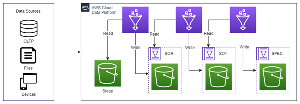
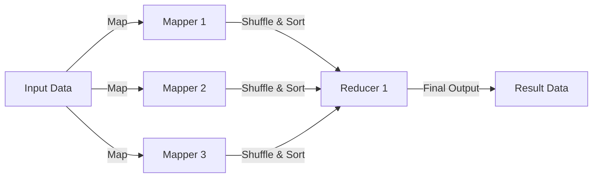

# **Big Data**

Antes de iniciar os estudos práticos em engenharia de dados, como a democratização de dados com AWS Glue e Spark, é fundamental compreender os conceitos essenciais da área. Esta seção apresentará os fundamentos necessários para uma base sólida no tema.

## 1. O que é Big Data?

De acordo com o site da Oracle, Big Data é um conjunto de dados muito grandes, com uma variedade de tipos e fontes. Até o momento de escrita desse repositório, os princípios do Big Data são baseados em 5 V's:

- <b>Volume:</b> as organizações coletam dados de várias fontes, tornando o volume muito grande.
- <b>Velocidade:</b> os dados são transmitidos em alta velocidade e devem ser tratados em tempo hábil.
- <b>Variedade:</b> os dados vêm em todos os tipos e formatos. Dados estruturados (padronizados, com os mesmos atributos para todos os valores de dados). Semi estruturados (json). Não Estruturados (documento, imagem, áudio, vídeos etc.)
- <b>Veracidade:</b> a qualidade dos dados capturados pode variar muito, afetando a precisão das análises
- <b>Valor:</b> é necessário transformar os dados em valor.

<b>Referências</b>

[O que é big data?](https://www.oracle.com/br/big-data/what-is-big-data/) 
[O que são dados estruturados?](https://aws.amazon.com/pt/what-is/structured-data/#:~:text=Os%20dados%20estruturados%20t%C3%AAm%20os,evento%20e%20valor%20da%20reserva.)

## 2. Desafios do Big Data

O Big Data apresenta desafios significativos, como:

- Armazenamento e gerenciamento de grandes volumes de dados.
- Integração de diferentes fontes de dados.
- Análise de grandes conjuntos de dados para obter insights.
- Necessidade de fornecer suporte para ‘Fast Data’ (capacidade de processar fluxos de dados em alta velocidade e tomar decisões em tempo real).

## 3. Dados transacionais
Dados transacionais são informações capturadas de transações. Eles registram a hora da transação, o local onde ocorreu, os preços dos itens comprados, a forma de pagamento empregada, os descontos, se houver, e outras quantidades e qualidades associadas à transação. **Os dados transacionais geralmente são capturados no ponto de venda.**

O trabalho que é realizado por sistemas transacionais é normalmente conhecido com OLTP (Processamento de Transações Online). O sistema OLTP tem como objetivo principal processar as transações do banco de dados.

Exemplos:

- <b>OLTP:</b> processar pedidos, atualizar estoque e gerenciar contas de clientes.

<b>Referências</b>

[O que são dados transacionais?](https://www.tibco.com/pt-br/reference-center/what-is-transactional-data) 
[Qual é a diferença entre OLAP e OLTP?](https://aws.amazon.com/pt/compare/the-difference-between-olap-and-oltp/)

## 4. Dados informacionais
Dados informacionais possuem o objetivo de atender a necessidade da tomada de decisão e para isso se baseia em grandes volumes de dados da base transacional.

Nesse caso, o histórico é essencial e necessita de muita armazenagem. E essas características são denonimadas ao sistema OLAP (Processamento Analítico Online). O objetivo principal do processamento analítico on-line (OLAP) é analisar dados agregados.

Exemplos:

- <b>OLAP:</b> gerar relatórios, realizar análises complexas de dados e identificar tendências.

<b>Referências</b>

[Modelagem de Dados](https://www.portalgsti.com.br/2017/02/modelagem-de-dados-o-que-e-e-para-que-serve-para-um-dba.html) 
[Qual é a diferença entre OLAP e OLTP?](https://aws.amazon.com/pt/compare/the-difference-between-olap-and-oltp/)

## 5. Ingestão de dados
A ingestão de dados é o processo de extrair dados de uma variedade de fontes e transferi-los para um local de destino onde podem ser depositados e analisados.

A extração pode ser feita de planilhas, webscrapping, aplicativos internos etc. Os destinos podem ser banco de dados, data warehouses etc.

A ingestão pode ser feita de duas maneiras, sendo elas:

- **Ingestão em tempo real (streaming):** útil quando os dados são sensíveis ao tempo. Os dados são extraídos, processados ​​e armazenados assim que são gerados para a tomada de decisões em tempo real. Por exemplo, os dados adquiridos do app do Itaú deve ser monitorado continuamente para garantir a disponibilidade para o usuário.
- **Ingestão em lote (batch):** os dados são movidos em intervalos agendado de forma recorrente. É utilizado para processos repetíveis. Por exemplo, relatórios que precisam ser gerados todos os dias.

## 6. Processamento de Dados
Processamento de dados é um conjunto de atividades que visam organizar informações. Neste tópico, será abordado ETL e ELT.

### 6.1 Processo ETL
1. Extração dos dados brutos de várias fontes;
2. Transformação dos dados;
3. Carregamento desses dados em um banco de dados de destino.

### 6.2 Processo ELT
1. Extração dos dados brutos de várias fontes;
2. Carregamento dos dados em eu estado natural em um data warehouse ou data lake;
3. Transformação dos dados conforme necessário enquanto está no sistema de destino.

Com o ELT, toda a limpeza, transformação e enriquecimento de dados ocorrem dentro do data warehouse. Você pode interagir e transformar os dados brutos quantas vezes forem necessárias.

### 6.3 História do ETL e ELT
O ETL existe desde a década de 1970, tornando-se especialmente popular com o surgimento dos data warehouses. No entanto, **os data warehouses tradicionais exigiam processos ETL personalizados para cada fonte de dados.**

A evolução das tecnologias de nuvem mudou o que era possível. Agora, **as empresas podiam armazenar dados brutos ilimitados em grande escala e analisá-los posteriormente, conforme necessário.** O ELT se tornou o método moderno de integração de dados para análises eficientes.

### 6.4 Principais diferenças

<table>
    <thead>
        <tr>
            <th>Descrição </th>
            <th>ETL</th>
            <th>ELT</th>
        </tr>
    </thead>
    <tbody>
		 <tr>
            <td align="left">Local de transformação e carga</td>
            <td align="left">Transforma dados em um servidor de processamento secundário.</td>
            <td align="left">Carrega dados brutos diretamente no data warehouse de destino. Uma vez lá, você pode transformar os dados sempre que precisar.</td>
        </tr>
		<tr>
            <td align="left">Compatibilidade de dados</td>
            <td align="left">Adequado para dados estruturados que você pode representar em tabelas com linhas e colunas.</td>
            <td align="left">Lida com todos os tipos de dados, incluindo dados não estruturados.</td>
        </tr>
        <tr>
            <td align="left">Velocidade</td>
            <td align="left">Possui uma etapa adicional antes de carregar dados no destino, que é difícil de escalar e desacelera o sistema à medida que o tamanho dos dados.</td>
            <td align="left"> O ELT é mais rápido que o ETL. Utiliza o poder de processamento e a paralelização que os data warehouses em nuvem oferecem para fornecer transformação de dados em tempo real ou quase em tempo real para análise.</td>
        </tr>
            <tr>
            <td align="left">Custos</td>
            <td align="left">Exige o envolvimento da análise desde o início. É necessário que os analistas planejem com antecedência os relatórios que desejam gerar e definam estruturas e formatação de dados. O tempo necessário para a configuração aumenta, o que aumenta os custos.</td>
            <td align="left">Tem menos sistemas do que o ETL, pois todas as transformações ocorrem no data warehouse de destino. Com menos sistemas, há menos para manter, resultando em uma pilha de dados mais simples e menores custos de configuração.</td>
        </tr>
    </tbody>
</table>

### 6.5 Quando usar
Após vermos todas as vantagens, o ETL só teria necessidade em bancos de dados antigos. Fora isso, o ELT é mais recomendado.

<b>Referências</b>

[Qual é a diferença entre ETL e ELT?](https://aws.amazon.com/pt/compare/the-difference-between-etl-and-elt/)

## 7. Camadas de dados

As camadas SOR (System of Record), SOT (System of Transformation) e SPEC (Specialized Processing Engines) gerenciam diferentes estágios do ciclo de vida dos dados, desde o armazenamento bruto até a transformação e o processamento especializado. Abaixo breve descrição das camadas:

- **Camada SOR (System of Record):** Responsável pelo armazenamento inicial dos dados brutos, funcionando como a principal referência para informações ainda não processadas;
- **Camada SOT (System of Transformation):** Destinada à transformação, limpeza e preparação dos dados para análise. Nessa etapa, são aplicadas regras de negócios e ajustes necessários para garantir a qualidade das informações;
- **Camada SPEC (Specialized Processing Engines):** Focada em processamentos avançados ou especializados, como execução de algoritmos de machine learning, geração de novas features a partir dos dados e transformações específicas para aprofundar as análises e gerar insights.

**Desenho de camadas de dados, processamento e ingestão**

<figure markdown="span">
  { width="800" }
</figure>

<b>Referências</b>

[Como o Itaú reduziu custos de armazenamento no Amazon S3](https://aws.amazon.com/pt/blogs/aws-brasil/como-o-itau-reduziu-custos-de-armazenamento-no-amazon-s3/)

## 8. Tipos de dados

Existem 3 tipos de dados, sendo:

- **Dados Estruturados:** São dados organizados em tabelas, como em bancos de dados. Cada dado tem um formato específico, como números ou textos, o que facilita armazenar e acessar.
- **Dados Semi-Estruturados:** São dados que têm alguma organização, mas não tão rígida como em tabelas. Exemplos são arquivos JSON e XML, que têm uma estrutura, mas não são fixos como os dados estruturados.
- **Dados Não Estruturados:** São dados sem um formato organizado, como fotos, vídeos, e-mails e postagens em redes sociais. Eles são mais difíceis de analisar sem ferramentas específicas.

## 9. Formatos de dados

Os formatos mais utilizados no cenário de democratização de dados são:

| **Formato** | **Tipo de Armazenamento**   | **Estrutura**           | **Principais Vantagens**                                      | **Exemplos de Uso**                                |
|-------------|-----------------------------|-------------------------|-------------------------------------------------------------|----------------------------------------------------|
| **LZO**     | Compressão de dados         | Não estruturado         | Compressão rápida e eficiente para grandes volumes de dados.  | Compressão de logs e grandes datasets em Hadoop.    |
| **Parquet** | Armazenamento colunar       | Estruturado (colunas)    | Leitura rápida de grandes volumes de dados, ótimo para consultas de colunas específicas. | Armazenamento de dados em data lakes, Big Data.     |
| **ORC**     | Armazenamento colunar       | Estruturado (colunas)    | Alta compressão e performance para leitura e processamento.   | Armazenamento de grandes logs, análise de dados no Hive. |
| **Avro**    | Serialização de dados       | Estruturado (linha)      | Compacto, eficiente para transmissão de dados em sistemas distribuídos. | Arquivos de eventos e streaming de dados.           |
| **XML**     | Texto                       | Hierárquico (tags)       | Facilita a leitura e escrita, mas mais pesado para grandes volumes de dados. | Arquivos de configuração, trocas de dados entre sistemas. |
| **JSON**    | Texto                       | Estruturado (pares chave-valor) | Leve, fácil de ler e escrever, amplamente usado em APIs e integração. | APIs, armazenamento de configurações, respostas de serviços web. |

!!!info

    - **Compressão de Dados**: Refere-se a reduzir o tamanho dos arquivos para otimizar o armazenamento ou a transferência. Em vez de armazenar um arquivo grande, você usa um algoritmo para comprimi-lo, tornando-o mais leve. **Exemplo**: Compactar um arquivo de log de dados (como .gz) para reduzir o espaço usado no armazenamento ou acelerar a transferência entre sistemas.

    - **Serialização de Dados**: Transformar dados estruturados em um formato que pode ser facilmente armazenado ou transmitido, como transformar um objeto ou estrutura em bytes. **Exemplo**: Serializar um dataframe em formato Parquet ou Avro para armazená-lo em um banco de dados ou transmitir entre sistemas distribuídos.

## 10. Hadoop

De acordo com o [site oficial](https://hadoop.apache.org) da Apache, o Hadoop é um framework que permite processamento distribuído de big data ao longo de clusters. Sua arquitetura comporta uma alta escalabilidade, permeando desde servidores individuais até milhares de máquinas, cada uma oferecendo armazenamento e poder computacional local.

O Hadoop possui três elementos fundamentais para armazenar e processar de forma distribuída grandes quantidade de dados, sendo:

- **HDFS (Hadoop Distributed File System):** sistema de armazenamento distribuído do Hadoop
- **MapReduce:** modelo de programação baseado em mappers e reducers
- **YARN (Yet Another Resource Negotiator):** gerenciador de recursos do cluster Hadoop

Veremos detalhadamente cada um dos três elementos.

<b>Referências</b>

[Hadoop Core: HDFS](https://panini.hashnode.dev/hadoop-core-hdfs)

### 10.1 HDFS

O HDFS é um sistema de arquivos construído para armazenar grandes quantidades de dados com acesso através de padrões de streaming executado em clusters de hardware commodity. Elementos desta definição:

- **Padrões de streaming:** O HDFS segue o modelo write once, read many, onde grandes quantidades de dados são escritas uma vez e lidas várias vezes.
- **Hardware commodity:** O Hadoop funciona em clusters de máquinas simples, aproveitando replicação e alta disponibilidade para reduzir custos.

O HDFS contribui para soluções de armazenamento de grandes quantidades de dados da seguinte forma:

Imagine um arquivo de texto de 50 terabytes de volume que precisa ser armazenado e posteriormente transformado em busca de novos insights dentro de uma companhia.

De forma direta, este massivo conjunto de dados não pode ser comportado por HDs ou SSDs com a tecnologia existente até o momento de escrita deste repositório. Assim, na impossibilidade de armazenar grandes volumes em uma única máquina, a resposta mais objetiva possível é a utilização de múltiplas máquinas capazes de comportar, cada uma, uma parcela (ou uma partição) do arquivo de dados. **Á esta organização de múltiplas máquinas dá-se o nome de cluster.**

### 10.1.1 HDFS - Replicação de Dados no Cluster

Uma característica interessante do HDFS são seus blocos de armazenamento de 128MB (ou 2510MB em alguns cenários) do hardware commodity e replicação de dados no cluster. Se um computador do cluster hadoop falhar, o HDFS  automaticamente irá garantir que os dados solicitados pela requisição serão retornados através de uma fonte alternativa de replicação.

### 10.1.2 HDFS - Arquitetura

Quando um client realiza uma requisição ao cluster Hadoop, estará eventualmente interagindo com diferentes tipos de nós do sistema que atuam em um padrão master-worker, sendo eles:

- **Namenodes (master):** gerencia toda a árvore do sistema de armazenamento e os metadados para todos os arquivos e diretórios presentes. Os namenodes mantém um arquivo conhecido como edit log responsável por registrar informações sobre o que é criado, mantido ou alterado no cluster. Além disso, possuem informações de todos os datanodes do sistema.
- **Datanodes (worker):** atuam como os verdadeiros trabalhadores do cluster. São eles quem armazenam os dados em blocos e retornam, sempre que solicitados, informações para o namenode para que este saiba exatamente a localização dos arquivos.

<b>Referências</b>

[Hadoop Core: HDFS](https://panini.hashnode.dev/hadoop-core-hdfs)

### 10.2 MapReduce

MapReduce é um modelo de programação desenhado para processar grandes volumes de dados em paralelo, dividindo o trabalho em múltiplos processadores em um cluster de computadores.

Quando a escala dos dados beira os Petabytes, cenário comum em Big Data, o tempo de processamento com um HDD ou SSD é insuficiente para comportar as necessidades do mundo moderno e é por isso que existe o MapReduce.

Basicamente, o MapReduce possui 5 etapas, sendo elas:

- **Input Data:** dados que serão utilizados para o MapReduce.
- **Split Data:** dados são divididos.
- **Map:** etapa onde cada task recebe uma porção de dados, ou seja, o conjunto de dados está armazenado de maneira distribuída em diferentes blocos e em diferentes nós em um cluster de computadores.
- **Shuffle and Sort:** etapa onde os dados são unificados em cada nó do cluster de modo a criar um input facilitado para a subsequente tarefa de reduce.
- **Reduce:** etapa onde são executadas as agregações e sumarizações dos dados, tendo seus resultados unificados para proporcionar uma sáida final.

<!--  -->

<b>Referências</b>

[MapReduce](https://panini.hashnode.dev/hadoop-core-mapreduce)

### 10.3 YARN

O YARN é o sistema que gerencia os recursos no cluster de computadores, decidindo quem executa as tarefas, quando as mesmas serão executadas, quais nós estão disponíveis para receber demandas e quais estão totalmente ocupados. O YARN é como o coração que permite o funcionamento do cluster.

<b>Referências</b>

[Yarn](https://panini.hashnode.dev/hadoop-core-yarn)

## 11. Apache Spark

O Spark é um sistema de processamento distribuído de big data que foi criado para resolver as limitações do MapReduce. Antes do Spark, cada etapa exigia uma leitura e gravação no disco, tornado mais lento, devido à latência da E/S do disco. Já no Spark, o processamento é feito na **memória**, reduzindo o número de etapas em uma tarefa e reutilizando dados em várias operações paralelas.

### 11.1 Workloads do Apache Spark

- **Spark Core:** base para a plataforma.
- **Spark SQL:** consultas interativas.
- **Spark Streaming:** análises em tempo real.
- **Spark MLlib:** para machine learning.
- **Spark GraphX:** processamento de gráficos.

<b>Referências</b>

[O que é Apache Spark?](https://aws.amazon.com/pt/what-is/apache-spark/)

### 11.2 Benefícios do Apache Spark

- **Rápido:** por meio do armazenamento em cache na memória.
- **Para desenvolvedores:** sustenta de modo nativo Java, Scala, R e Python, oferecendo a você várias linguagens para a criação de aplicativos.

### 11.3 Apache Hadoop vs Apache Spark

O Hadoop possui o HDFS para armazenamento e YARN para gerenciar recusos de computação.

O Spark não possui sistema próprio de armazenamento, mas pode consultar no HDFS, Redshift, S3 etc.

## 12. Qualidade dos dados

Qualidade de Dados (Data Quality, em inglês) é uma avaliação da precisão, completude, consistência, confiabilidade e atualidade dos dados. Em outras palavras, refere-se ao grau de excelência dos dados

### 12.1 Métricas de qualidade
**1. Completude:** Isso se refere a se todos os dados necessários estão disponíveis. Se houver campos obrigatórios ausentes em um conjunto de dados, ele não será considerado completo.

**2. Consistência:** Os dados precisam ser consistentes, o que significa que não devem existir discrepâncias quando comparados entre diferentes conjuntos de dados ou diferentes partes do mesmo conjunto de dados.

**3. Conformidade:** Isso se refere ao grau em que os dados aderem a padrões especificados, convenções e regras de negócios. Por exemplo, um número de telefone deve estar em um formato válido.

**4. Integridade:** Isso se refere à validade e consistência de relacionamentos entre entidades e registros de dados, como referências cruzadas entre tabelas em um banco de dados relacional.

**5. Precisão:** Isso se refere ao grau em que os dados representam a realidade ou a verdade. A precisão pode ser difícil de medir, pois requer um ponto de referência verdadeiro.

**6. Atualidade:** Isso se refere à relevância dos dados no tempo. Isso pode variar dependendo do contexto; por exemplo, dados de vendas de um dia atrás podem ser considerados atuais para algumas empresas, enquanto para outras empresas esses dados podem ser considerados desatualizados.

<b>Referências</b>

[As 6 Dimensões da Qualidade de Dados (Data Quality)](https://blog.dsacademy.com.br/as-6-dimensoes-da-qualidade-de-dados-data-quality/)