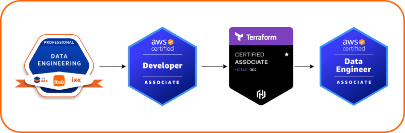

## **Objetivo**

Olá, muito prazer, sou o Vinicius!

Até o final de 2024, atuei em uma squad de negócios, focado em análise de dados. Porém, descobri meu interesse em unir a engenharia de software com dados e estou iniciando minha carreira como engenheiro de dados!

**O objetivo desse site é documentar todo o processo de aprendizado para me tornar um engenheiro de dados.**

De acordo com o [Microsoft Learn](https://learn.microsoft.com/pt-br/training/career-paths/data-engineer), um engenheiros de dados integra, transforma e consolida dados de vários sistemas de dados estruturados e não estruturados em estruturas adequadas para a criação de soluções de análise.

Como atuo na governança de todas as APIs da instituição, iniciarei meus estudos focando em conceitos de engenharia de software aplicados ao universo das APIs. Após construir uma base sólida nesse tema, direcionarei meus estudos para as certificações voltados à engenharia de dados.

<!-- <figure markdown="span">
  { width="800" }
</figure> -->

## **Sobre mim**

- 💻 2021: Conheci a formação em Engenharia de Software da [École 42](https://42.fr/en/homepage/).
- 📚 2022: Ingressei no curso de Ciência de Dados na FATEC.
- 💼 2023: Entrei como estagiário no Itaú Unibanco.
- 🎯 2024: Fui efetivado como Analista de Dados.
- 🚀 2025: Descobri meu interesse em unir engenharia de software e dados e estou iniciando minha carreira como Engenheiro de Dados.
- ✍️ Publiquei dois artigos Itaú Tech:
	- [A jornada de dados no Itaú Unibanco: modelagem e engenharia de dados e analytics](https://medium.com/itautech/a-jornada-de-dados-no-ita%C3%BA-unibanco-modelagem-e-engenharia-de-dados-e-analytics-6dfd9e5d66cc).
	- [A jornada de dados no Itaú Unibanco: ciência de dados e engenharia de machine learning](https://medium.com/itautech/a-jornada-de-dados-no-ita%C3%BA-unibanco-ci%C3%AAncia-de-dados-e-engenharia-de-machine-learning-d15311dbf38e).
- 🎙️ Fui convidado para o podcast Data Hackers! Participei do [episódio ##88: Jornada de Engenharia de Dados e Analytics no Itaú](https://medium.com/data-hackers/jornada-de-engenharia-de-dados-e-analytics-no-ita%C3%BA-data-hackers-podcast-88-5518d40f2b38).
- 🏆 Meu time venceu a [Batalha de Dados do Itaú Unibanco de 2024](https://www.linkedin.com/posts/viniciusrio_vencedores-da-batalha-de-dados-do-ita%C3%BA-unibanco-activity-7224895881529974784-CuUD?utm_source=share&utm_medium=member_desktop).